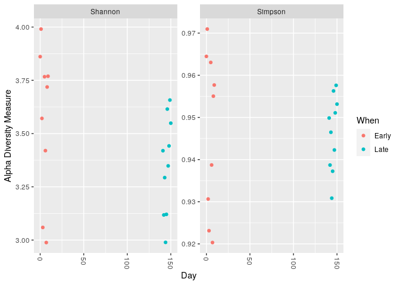
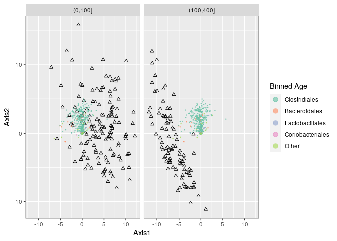

03\_Phyloseq tutorial
================

  - [Introduction](#introduction)
      - [Appele des librarys](#appele-des-librarys)
      - [Les données de tutoriel DADA2](#les-données-de-tutoriel-dada2)
  - [Analyse phyloseq](#analyse-phyloseq)
      - [Combiner les données dans un objet
        phyloseq](#combiner-les-données-dans-un-objet-phyloseq)
      - [L’arbre phylogénétique](#larbre-phylogénétique)
      - [Chargements des données dans un
        objet](#chargements-des-données-dans-un-objet)
      - [Construction d’un objet](#construction-dun-objet)
      - [Alpha diversité suivant deux indices Shannon et
        simpson](#alpha-diversité-suivant-deux-indices-shannon-et-simpson)
      - [Ordination](#ordination)
      - [Visualisation de l’ordination](#visualisation-de-lordination)
  - [Tutorial de phyloseq](#tutorial-de-phyloseq)
      - [Importation de l’objet](#importation-de-lobjet)
      - [Filtrage](#filtrage)
          - [Filtrage taxonomique](#filtrage-taxonomique)
              - [Indiquer les rangs dans l’ensemble des
                données](#indiquer-les-rangs-dans-lensemble-des-données)
              - [Créer un tableau, nombre de caractéristiques pour
                chaque
                phyla](#créer-un-tableau-nombre-de-caractéristiques-pour-chaque-phyla)
              - [Créer une table avec le nombre dans chaque
                phyla](#créer-une-table-avec-le-nombre-dans-chaque-phyla)
              - [Calculer la prévalence de chaque caractéristique
                stocker sous forme de data.frame, chaque ensemble avec
                les data
                frame](#calculer-la-prévalence-de-chaque-caractéristique-stocker-sous-forme-de-data.frame-chaque-ensemble-avec-les-data-frame)
              - [Ajoutez la taxonomie et le nombre total de read à ces
                data
                frame](#ajoutez-la-taxonomie-et-le-nombre-total-de-read-à-ces-data-frame)
              - [Calculer les prévalences totales (1) et les moyennes
                (2)des caractéristiques de chaque
                embrenchement](#calculer-les-prévalences-totales-1-et-les-moyennes-2des-caractéristiques-de-chaque-embrenchement)
              - [Définir les phyla pour les
                filtrer](#définir-les-phyla-pour-les-filtrer)
              - [Filtrer les entrées avec un Phyla non
                identifié](#filtrer-les-entrées-avec-un-phyla-non-identifié)
          - [Filtrer la prévalence](#filtrer-la-prévalence)
          - [Définir le seuil de prévalence comme étant de 5 % du total
            des
            échantillons](#définir-le-seuil-de-prévalence-comme-étant-de-5-du-total-des-échantillons)
          - [Exécuter le filtre de prévalence, en utilisant la fonction
            `prune_taxa()`](#exécuter-le-filtre-de-prévalence-en-utilisant-la-fonction-prune_taxa)
      - [Agglomérer les taxa](#agglomérer-les-taxa)
      - [Arbres](#arbres)
      - [Regrouper les groupes](#regrouper-les-groupes)
      - [Abondance](#abondance)
      - [Transformer en abondance
        relative.](#transformer-en-abondance-relative.)
      - [On fait des plot pour voir nos abondances
        relatives](#on-fait-des-plot-pour-voir-nos-abondances-relatives)
      - [Combiner chaque plot en un seul
        graphique](#combiner-chaque-plot-en-un-seul-graphique)
      - [Ordonner la taxonomie](#ordonner-la-taxonomie)
      - [Prétraitement](#prétraitement)
      - [Différentes ordination](#différentes-ordination)
          - [Ordination PCoA avec l’indice
            Bray-Curtis](#ordination-pcoa-avec-lindice-bray-curtis)
          - [Les abondances relatives](#les-abondances-relatives)
          - [On enlève les échantillons en dessous de 100
            reads](#on-enlève-les-échantillons-en-dessous-de-100-reads)
          - [PCoA à partir de l’indice de Bray
            Curtis](#pcoa-à-partir-de-lindice-de-bray-curtis)
          - [Double principal coordinates analysis
            (DPCoA)](#double-principal-coordinates-analysis-dpcoa)
          - [PCA on ranks](#pca-on-ranks)
          - [Transformation du seuil de
            classement](#transformation-du-seuil-de-classement)
          - [Canonical correspondence](#canonical-correspondence)
      - [Apprentissage supervisé](#apprentissage-supervisé)
  - [Fonction random forest](#fonction-random-forest)
      - [Analyses basées sur des
        graphiques](#analyses-basées-sur-des-graphiques)
          - [Créer et tracer des
            graphiques](#créer-et-tracer-des-graphiques)
              - [Création de vecteurs](#création-de-vecteurs)
              - [Définir l’axe des x et des y, la légende, les
                unités](#définir-laxe-des-x-et-des-y-la-légende-les-unités)
          - [Graphique basé sur le test deux
            échantillons](#graphique-basé-sur-le-test-deux-échantillons)
              - [Minimum Spanning Tree (MST) (Arbre à portée
                minimale)](#minimum-spanning-tree-mst-arbre-à-portée-minimale)
              - [Les plus proches voisins](#les-plus-proches-voisins)
      - [Modélisation linéaire](#modélisation-linéaire)
      - [Calcul de l’alpha diversité](#calcul-de-lalpha-diversité)
      - [Tests multiples hiérarchisés](#tests-multiples-hiérarchisés)
      - [Techniques multitables](#techniques-multitables)

Ce document R, sert pour des analyses grâce au package de phyloseq.

# Introduction

## Appele des librarys

Il faut avec le 001 installer le package de phyloseq. Trois librarys
nous seront utiles : ggplot2, dada2, phyloseq

``` r
library(ggplot2)
library(dada2)
```

    ## Loading required package: Rcpp

``` r
library(phyloseq)
```

## Les données de tutoriel DADA2

Nous Chargons les données du précédent document R qui traite les donné
du toturiel dada2

``` r
load("~/CC1_Ecog2/02_data-Analysis_Final2Env")
```

# Analyse phyloseq

## Combiner les données dans un objet phyloseq

\-samdf = une fonction qui va permmettre de faire un graph qui englobe
les ensembles de données

``` r
samples.out <- rownames(seqtab.nochim)
subject <- sapply(strsplit(samples.out, "D"), `[`, 1)
gender <- substr(subject,1,1)
subject <- substr(subject,2,999)
day <- as.integer(sapply(strsplit(samples.out, "D"), `[`, 2))
samdf <- data.frame(Subject=subject, Gender=gender, Day=day)
samdf$When <- "Early"
samdf$When[samdf$Day>100] <- "Late"
rownames(samdf) <- samples.out
```

## L’arbre phylogénétique

La relation phylogénétique est utilisée pour informer les analyses en
aval, elle indique le calcul des distances phylogénétiques entre les
communautés microbiennes. Construire l’arbre phylogénétique reliant de
novo les variantes de séquences importées. Alignement multiple en
utilisant la library DECIPHER

``` r
library(phangorn)
```

    ## Loading required package: ape

``` r
library(DECIPHER)
```

    ## Loading required package: Biostrings

    ## Loading required package: BiocGenerics

    ## Loading required package: parallel

    ## 
    ## Attaching package: 'BiocGenerics'

    ## The following objects are masked from 'package:parallel':
    ## 
    ##     clusterApply, clusterApplyLB, clusterCall, clusterEvalQ,
    ##     clusterExport, clusterMap, parApply, parCapply, parLapply,
    ##     parLapplyLB, parRapply, parSapply, parSapplyLB

    ## The following objects are masked from 'package:stats':
    ## 
    ##     IQR, mad, sd, var, xtabs

    ## The following objects are masked from 'package:base':
    ## 
    ##     anyDuplicated, append, as.data.frame, basename, cbind, colnames,
    ##     dirname, do.call, duplicated, eval, evalq, Filter, Find, get, grep,
    ##     grepl, intersect, is.unsorted, lapply, Map, mapply, match, mget,
    ##     order, paste, pmax, pmax.int, pmin, pmin.int, Position, rank,
    ##     rbind, Reduce, rownames, sapply, setdiff, sort, table, tapply,
    ##     union, unique, unsplit, which, which.max, which.min

    ## Loading required package: S4Vectors

    ## Loading required package: stats4

    ## 
    ## Attaching package: 'S4Vectors'

    ## The following object is masked from 'package:base':
    ## 
    ##     expand.grid

    ## Loading required package: IRanges

    ## 
    ## Attaching package: 'IRanges'

    ## The following object is masked from 'package:phyloseq':
    ## 
    ##     distance

    ## Loading required package: XVector

    ## 
    ## Attaching package: 'Biostrings'

    ## The following object is masked from 'package:ape':
    ## 
    ##     complement

    ## The following object is masked from 'package:base':
    ## 
    ##     strsplit

    ## Loading required package: RSQLite

``` r
seqs <- getSequences(seqtab.nochim)
names(seqs) <- seqs # This propagates to the tip labels of the tree
alignment <- AlignSeqs(DNAStringSet(seqs), anchor=NA,verbose=FALSE)
phangAlign <- phyDat(as(alignment, "matrix"), type="DNA")
dm <- dist.ml(phangAlign)
treeNJ <- NJ(dm) # Note, tip order != sequence order
fit = pml(treeNJ, data=phangAlign)
```

    ## negative edges length changed to 0!

``` r
fitGTR <- update(fit, k=4, inv=0.2)
fitGTR <- optim.pml(fitGTR, model="GTR", optInv=TRUE, optGamma=TRUE,
        rearrangement = "stochastic", control = pml.control(trace = 0))
detach("package:phangorn", unload=TRUE)
```

## Chargements des données dans un objet

On ajoute l’arbre phylogénétique généré dans la variable ps déjà
existante

``` r
ps <- phyloseq(otu_table(seqtab.nochim, taxa_are_rows=FALSE),
               sample_data(samdf),
               tax_table(taxa),phy_tree(fitGTR$tree))
ps <- prune_samples(sample_names(ps) != "Mock", ps) # Remove mock sample
ps
```

    ## phyloseq-class experiment-level object
    ## otu_table()   OTU Table:         [ 232 taxa and 19 samples ]
    ## sample_data() Sample Data:       [ 19 samples by 4 sample variables ]
    ## tax_table()   Taxonomy Table:    [ 232 taxa by 7 taxonomic ranks ]
    ## phy_tree()    Phylogenetic Tree: [ 232 tips and 230 internal nodes ]

## Construction d’un objet

Apparition dans “global environment” À partir de phyloseq création d’un
objet, on a pris sample\_data –\> échantillon Création de variable à
partir de ce qu’on avait avant

``` r
dna <- Biostrings::DNAStringSet(taxa_names(ps))
names(dna) <- taxa_names(ps)
ps <- merge_phyloseq(ps, dna)
taxa_names(ps) <- paste0("ASV", seq(ntaxa(ps)))
ps
```

    ## phyloseq-class experiment-level object
    ## otu_table()   OTU Table:         [ 232 taxa and 19 samples ]
    ## sample_data() Sample Data:       [ 19 samples by 4 sample variables ]
    ## tax_table()   Taxonomy Table:    [ 232 taxa by 7 taxonomic ranks ]
    ## phy_tree()    Phylogenetic Tree: [ 232 tips and 230 internal nodes ]
    ## refseq()      DNAStringSet:      [ 232 reference sequences ]

## Alpha diversité suivant deux indices Shannon et simpson

``` r
plot_richness(ps, x="Day", measures=c("Shannon", "Simpson"), color="When")
```

    ## Warning in estimate_richness(physeq, split = TRUE, measures = measures): The data you have provided does not have
    ## any singletons. This is highly suspicious. Results of richness
    ## estimates (for example) are probably unreliable, or wrong, if you have already
    ## trimmed low-abundance taxa from the data.
    ## 
    ## We recommended that you find the un-trimmed data and retry.

<!-- -->

## Ordination

On fait une ordination NMDS

``` r
# Transform data to proportions as appropriate for Bray-Curtis distances
ps.prop <- transform_sample_counts(ps, function(otu) otu/sum(otu))
ord.nmds.bray <- ordinate(ps.prop, method="NMDS", distance="bray")
```

    ## Run 0 stress 0.08574537 
    ## Run 1 stress 0.08002299 
    ## ... New best solution
    ## ... Procrustes: rmse 0.04283649  max resid 0.1433507 
    ## Run 2 stress 0.08002299 
    ## ... New best solution
    ## ... Procrustes: rmse 2.199992e-06  max resid 5.977182e-06 
    ## ... Similar to previous best
    ## Run 3 stress 0.08002299 
    ## ... New best solution
    ## ... Procrustes: rmse 2.141692e-06  max resid 7.380548e-06 
    ## ... Similar to previous best
    ## Run 4 stress 0.08942912 
    ## Run 5 stress 0.1319352 
    ## Run 6 stress 0.08942865 
    ## Run 7 stress 0.080023 
    ## ... Procrustes: rmse 2.44458e-05  max resid 6.722036e-05 
    ## ... Similar to previous best
    ## Run 8 stress 0.08002299 
    ## ... Procrustes: rmse 4.147355e-06  max resid 9.984787e-06 
    ## ... Similar to previous best
    ## Run 9 stress 0.08574537 
    ## Run 10 stress 0.08002299 
    ## ... Procrustes: rmse 6.810995e-06  max resid 1.861126e-05 
    ## ... Similar to previous best
    ## Run 11 stress 0.09421601 
    ## Run 12 stress 0.08574537 
    ## Run 13 stress 0.08574537 
    ## Run 14 stress 0.08942876 
    ## Run 15 stress 0.08002299 
    ## ... Procrustes: rmse 2.639607e-06  max resid 8.717089e-06 
    ## ... Similar to previous best
    ## Run 16 stress 0.1216678 
    ## Run 17 stress 0.08574537 
    ## Run 18 stress 0.08002299 
    ## ... Procrustes: rmse 2.94524e-06  max resid 7.32441e-06 
    ## ... Similar to previous best
    ## Run 19 stress 0.08574537 
    ## Run 20 stress 0.08574537 
    ## *** Solution reached

## Visualisation de l’ordination

on colore la légende quand “when”

``` r
plot_ordination(ps.prop, ord.nmds.bray, color="When", title="Bray NMDS")
```

<!-- -->
\#\# Bar plot

``` r
library(ggplot2)
top20 <- names(sort(taxa_sums(ps), decreasing=TRUE))[1:20]
ps.top20 <- transform_sample_counts(ps, function(OTU) OTU/sum(OTU))
ps.top20 <- prune_taxa(top20, ps.top20)
plot_bar(ps.top20, x="Day", fill="Family") + facet_wrap(~When, scales = "free_x")
```

<!-- -->

# Tutorial de phyloseq

## Importation de l’objet

Télécharger l’objet phyloseq déjà construit sur le site suivant.

``` r
ps_connect <-url("https://raw.githubusercontent.com/spholmes/F1000_workflow/master/data/ps.rds")
ps = readRDS(ps_connect)
ps
```

    ## phyloseq-class experiment-level object
    ## otu_table()   OTU Table:         [ 389 taxa and 360 samples ]
    ## sample_data() Sample Data:       [ 360 samples by 14 sample variables ]
    ## tax_table()   Taxonomy Table:    [ 389 taxa by 6 taxonomic ranks ]
    ## phy_tree()    Phylogenetic Tree: [ 389 tips and 387 internal nodes ]

On a rajouté les données de phyloseq dans la variable ps contenant
l’arbre crée à partir des données de Dada2

## Filtrage

### Filtrage taxonomique

#### Indiquer les rangs dans l’ensemble des données

rank-names: permet de déterminer les rangs taxonomique de l’objet ps (
donnée du tutoriel phyloseq)

``` r
rank_names(ps)
```

    ## [1] "Kingdom" "Phylum"  "Class"   "Order"   "Family"  "Genus"

Il a été attribué le règne, le phylum, la classe , l’ordre , la Famille
et le Genre. L’espèce n’a pas été attribuée.

#### Créer un tableau, nombre de caractéristiques pour chaque phyla

\-tax\_table : la fonction permet de construire et d’accéder à une table
de noms taxinomique de l’objet ps -table : la fonction permet faire un
tableau de contingence en fonction de différents facteurs, ajout
tax\_table, au niveau du phylum. Le résultat indique le nombre de
séquences appartenant aux phylums désigné. Les NA sont des artefacts
dans le jeu de données, ils vont être supprimés.

``` r
table(tax_table(ps)[, "Phylum"], exclude = NULL)
```

    ## 
    ##              Actinobacteria               Bacteroidetes 
    ##                          13                          23 
    ## Candidatus_Saccharibacteria   Cyanobacteria/Chloroplast 
    ##                           1                           4 
    ##         Deinococcus-Thermus                  Firmicutes 
    ##                           1                         327 
    ##                Fusobacteria              Proteobacteria 
    ##                           1                          11 
    ##                 Tenericutes             Verrucomicrobia 
    ##                           1                           1 
    ##                        <NA> 
    ##                           6

Le phylum retrouver le plus souvent est le phylum des Firmicute avec 327
représentant. Il est suivi dans l’ordre décroissante des Bacteroidetes,
Actinobacteria, Proteobacteria, Cyanobacteria/Chloroplast. Il y a
Fusobacteria, Verrucomicrobia , Deinococcus-Thermu
,Candidatus\_Saccharibacteria, Tenericutes qui n’ont que 1 représentant.
Il y a 6 donné où aucun phyla n’a pu être attribuée. Il faut donc les
supprimer.

#### Créer une table avec le nombre dans chaque phyla

\-subset\_taxa : Il accélére le remplacement d’objets expérimentaux par
un appel de fonction. Le sous-ensemble sera basé sur une expression liée
aux colonnes et aux valeurs dans le créneau tax\_table

On supprime les OTU qui ont un résultat manquant ou un résultat
affichant NA. Les phyla qui ne sont ‘uncharacterized’. On enlève ceux
qu’on n’a pas réussi à catégoriser

``` r
ps <- subset_taxa(ps, !is.na(Phylum) & !Phylum %in% c("", "uncharacterized"))
```

#### Calculer la prévalence de chaque caractéristique stocker sous forme de data.frame, chaque ensemble avec les data frame

\-apply : Retourne un vecteur, un tableau ( ici OTU-table de ps ) ou une
liste de valeurs obtenus en appliquant une fonction aux marges d’un
tableau ou d’une matrice.

``` r
prevdf = apply(X = otu_table(ps),
               MARGIN = ifelse(taxa_are_rows(ps), yes = 1, no = 2),
               FUN = function(x){sum(x > 0)})
```

#### Ajoutez la taxonomie et le nombre total de read à ces data frame

\-data.frame : La fonction est de crée des cadres de données, des
collections de variables étroitement couplées qui partagent de
nombreuses propriétés des matrices et des listes, utilisées comme
structure de données fondamentale par la plupart des logiciels de
modélisation de R. Ici les données sont la prévalence, le total
d’abondance de ps et la table de taxonomie

On définit une variable prevdf qui est permet de montrer la prévalence
des caractéristiques dans notre jeu de données. On calcul la prévalence
de chaque caractéristiques de chaque data frame. Puis on ajoute les
reads à ces data frame et on réassigne une taxonomie

``` r
prevdf = data.frame(Prevalence = prevdf,
                    TotalAbundance = taxa_sums(ps),
                    tax_table(ps))
```

#### Calculer les prévalences totales (1) et les moyennes (2)des caractéristiques de chaque embrenchement

\-ddply : Pour chaque sous-ensemble d’une trame de données, appliquer la
fonction puis combiner les résultats dans une trame de données. -Cbind :
permet d’afficher les deux résultats en deux colonnes

``` r
plyr::ddply(prevdf, "Phylum", function(df1){cbind(mean(df1$Prevalence),sum(df1$Prevalence))})
```

    ##                         Phylum         1     2
    ## 1               Actinobacteria 120.15385  1562
    ## 2                Bacteroidetes 265.52174  6107
    ## 3  Candidatus_Saccharibacteria 280.00000   280
    ## 4    Cyanobacteria/Chloroplast  64.25000   257
    ## 5          Deinococcus-Thermus  52.00000    52
    ## 6                   Firmicutes 179.24771 58614
    ## 7                 Fusobacteria   2.00000     2
    ## 8               Proteobacteria  59.09091   650
    ## 9                  Tenericutes 234.00000   234
    ## 10             Verrucomicrobia 104.00000   104

La premirère colonne montre les différents phyla, la deuxième colonne
montre la prévalence moyenne et la troisième colonne monte la prévalence
totale (nombre total des échantillons). Ce la veut dire qu’on a observé
parmi tous les échantillons pour Actinobacteria observé au total 1562
fois. Il serait bien de montrer aussi le nombre de fois qu’on les
retrouve dans les échantillons et ainsi voir comment est calculée la
prévalence moyenne

La prévalence totale correspond aux nombres du phyla observé dans tous
les échantillons et la prévalence moyenne correspond au nombre du phyla
divisé par le nombre d’échantillons dans lequel il se trouve

Les Fusobacteria ont été retrouve que dans 2 échantillons.

#### Définir les phyla pour les filtrer

\-c() : la fonction combine les arguments fusobacteria et deinococcus
thermus dans une nouvelle variable appelé filtrePhyla

``` r
filterPhyla = c("Fusobacteria", "Deinococcus-Thermus")
```

#### Filtrer les entrées avec un Phyla non identifié

\-subet\_taxa : déjà expliqué, ici on va crée un objet ps1 qui n’aura
plus les deux phylum précédent (fusobacteria et deinococcus thermus)

``` r
ps1 = subset_taxa(ps, !Phylum %in% filterPhyla)
ps1
```

    ## phyloseq-class experiment-level object
    ## otu_table()   OTU Table:         [ 381 taxa and 360 samples ]
    ## sample_data() Sample Data:       [ 360 samples by 14 sample variables ]
    ## tax_table()   Taxonomy Table:    [ 381 taxa by 6 taxonomic ranks ]
    ## phy_tree()    Phylogenetic Tree: [ 381 tips and 379 internal nodes ]

On a donc de nouveau résultat avec la nouvelle variable ps1 une fois la
variable filtrePhyla enlevée. Les phyla “Fusobacteria”,
«Deinococcus-Thermus» sont enlevés de la table des taxa. Au départ on
389 taxa et après ces filtrations, on a 381 taxa. Donc il a été retiré 8
taxa, sachant que les Fusobacteria était au nombre de deux, alors les
Deinococcus-Thermus étaient au nombre de 6.

### Filtrer la prévalence

On assigne une nouvelle variable partir de la filtration effectuée
précédemment donc sans les phyla “Fusobacteria”, «Deinococcus-Thermus»
-ggplot: la fonction sert à réaliser un graphique avec différents
paramètres

``` r
prevdf1 = subset(prevdf, Phylum %in% get_taxa_unique(ps1, "Phylum"))
ggplot(prevdf1, aes(TotalAbundance, Prevalence / nsamples(ps),color=Phylum)) +
  # Include a guess for parameter
  geom_hline(yintercept = 0.05, alpha = 0.5, linetype = 2) +  geom_point(size = 2, alpha = 0.7) +
  scale_x_log10() +  xlab("Total Abundance") + ylab("Prevalence [Frac. Samples]") +
  facet_wrap(~Phylum) + theme(legend.position="none")
```

<!-- -->
Le graphique montre la prévalence en fonction des abondances totales des
différents phyla. Chaque point dans les figures correspond à un taxa
différents

### Définir le seuil de prévalence comme étant de 5 % du total des échantillons

On définit le seuil de prévalence à 5% Création d’une nouvelle variable
qui affiche le nombre total d’échantillon (360) \* 0,05

``` r
prevalenceThreshold = 0.05 * nsamples(ps)
prevalenceThreshold
```

    ## [1] 18

La prévalence avec le seuil à 0,05% indique 18.

### Exécuter le filtre de prévalence, en utilisant la fonction `prune_taxa()`

\-prune\_taxa: Une méthode générique S4 pour supprimer les OTU non
désirés des objets phylogénétiques, y compris les arbres, ainsi que
les objets phyloseq natifs des paquets.

``` r
keepTaxa = rownames(prevdf1)[(prevdf1$Prevalence >= prevalenceThreshold)]
ps2 = prune_taxa(keepTaxa, ps)
```

## Agglomérer les taxa

Combien de genres seraient présents après le filtrage? On prend ps2 qui
a eu le filtrage et la prévalence, on lui assigne jusqu’au rang «gène»
les ASV. Obtenir la longueur des vecteurs de ps2.

``` r
length(get_taxa_unique(ps2, taxonomic.rank = "Genus"))
```

    ## [1] 49

\-tax\_glom : La fonction permet de fusionner des espèces qui ont la
même taxonomie à un certain rang taxonomique en utilisant des données
catégorielles au lieu d’un arbre. jusqu’au «genre» à partir de ps2, on
obtient alors ps3.

``` r
ps3 = tax_glom(ps2, "Genus", NArm = TRUE)
```

\-H1 permet de définir la hauteur -ps4 c’est un variable où on agglomère
les taxa étroitement liés en utilisant le regroupement à lien unique.
-tip\_glom : La fonction permet de séparées les pointes de l’arbre par
une distance cophénique inférieure à h seront agglomérées en un seul
taxon à l’aide de merge\_taxa. Ici h = 0,4

``` r
h1 = 0.4
ps4 = tip_glom(ps2, h = h1)
```

## Arbres

\-multiPlotTitleTextSize: cela permet de mettre une taille de police au
titre des arbres. -plot\_tree : La fonction permet de dessiné un
diagramme en arbre des fréquences (sous forme de nœuds) et des
probabilités (sous forme d’arêtes)

On crée l’arbre ps2, ps3 et ps4 avec la fonction plot\_tree On a les
arbres phylogénétiques correspondants à ps2, ps3 et ps4

``` r
multiPlotTitleTextSize = 15
p2tree = plot_tree(ps2, method = "treeonly",
                   ladderize = "left",
                   title = "Before Agglomeration") +
  theme(plot.title = element_text(size = multiPlotTitleTextSize))
p3tree = plot_tree(ps3, method = "treeonly",
                   ladderize = "left", title = "By Genus") +
  theme(plot.title = element_text(size = multiPlotTitleTextSize))
p4tree = plot_tree(ps4, method = "treeonly",
                   ladderize = "left", title = "By Height") +
  theme(plot.title = element_text(size = multiPlotTitleTextSize))
```

## Regrouper les groupes

\-grid.arrange : La fonction permet de configurez une mise en page de
gtable pour placer plusieurs grobs sur une page.

``` r
gridExtra::grid.arrange(nrow = 1, p2tree, p3tree, p4tree)
```

<!-- -->

Les trois arbres apparaissent en même temps. On voit bien une différence
entre les 3 arbres. L’arbre avant agglomération est très ramassé.

## Abondance

Diagrammes à barres de l’abondance relative des taxa dans les
échantillons. -plot\_abundance : Diagrammes à barres de l’abondance
relative des taxa avec des arguments pour la formes, les couleurs ..

``` r
plot_abundance = function(physeq,title = "",
                          Facet = "Order", Color = "Phylum"){
  # Arbitrary subset, based on Phylum, for plotting
  p1f = subset_taxa(physeq, Phylum %in% c("Firmicutes"))
  mphyseq = psmelt(p1f)
  mphyseq <- subset(mphyseq, Abundance > 0)
  ggplot(data = mphyseq, mapping = aes_string(x = "sex",y = "Abundance",
                              color = Color, fill = Color)) +
    geom_violin(fill = NA) +
    geom_point(size = 1, alpha = 0.3,
               position = position_jitter(width = 0.3)) +
    facet_wrap(facets = Facet) + scale_y_log10()+
    theme(legend.position="none")
}
```

Diagrammes à barres de l’abondance relative des taxa dans les
échantillons.

## Transformer en abondance relative.

On a une nouvelle objet “ps3ra” -transform\_sample\_counts :La fonction
transforme les comptages d’échantillons d’une matrice d’abondance de
taxons selon une fonction fournie par l’utilisateur. Les comptages de
chaque échantillon seront transformés individuellement.

``` r
ps3ra = transform_sample_counts(ps3, function(x){x / sum(x)})
```

## On fait des plot pour voir nos abondances relatives

\-plot\_abundance : déjà expliqué Maintenant on fait des graphes qui
compare avant les abondances relatives et après transformation des
abondances relatives

``` r
plotBefore = plot_abundance(ps3,"")
plotAfter = plot_abundance(ps3ra,"")
```

## Combiner chaque plot en un seul graphique

``` r
gridExtra::grid.arrange(nrow = 1, plotBefore, plotAfter)
```

<!-- -->
Ces graphiques montrent alors la différences entre les abondances
originales et les abondances relatives. Nous voyons la comparaison des
abondances initiales (panneau supérieur) et des abondances relatives
(panneau inférieur).Les lactobacillales et les Erylpeltrichales semble
avoir une forme bimodale, alors que les clostridales sembles être
monomodal. Pour vérifier que les lactobacillales sont bien bimodale ,
nous allon crée des sous ensemble .

## Ordonner la taxonomie

Pour vérifier les profil d’abaondance nous allon traçer le sous-ensemble
taxonomique dans les données. -subset\_taxa : créé une sous-ensemble à
partir de l’objet ms3ra pour l’ordre des Lactobacillales. Spécifions un
rang taxonomique plus précis à l’argument -plot\_abundance : va
construire les graphiques de l’abondance de l’objet psOrd qui a été
défini comme un sous ensemble des lactobacillalus défini au rang
taxonomique du genre

``` r
psOrd = subset_taxa(ps3ra, Order == "Lactobacillales")
plot_abundance(psOrd, Facet = "Genus", Color = NULL)
```

<!-- -->
Nous voyons que les Lactobacillales ont une organisation modale. Donc la
forme bimodale observé précisément serait deux à un mélange des sexe
peut-être

## Prétraitement

On ajoute des colonnes à nos données pour noter les grahiques. -qplot :
La focntion permet de créer différents types de graphique en utilisant
un schéma d’appel cohérent. Ici la forme demandé par geom est un
histogramme

``` r
qplot(sample_data(ps)$age, geom = "histogram",binwidth=20) + xlab("age")
```

<!-- -->
Le graph montre que la covariance de l’âge appartient à trois groupes
distincts. La Montre que l’âge des souris se répartit en plusieurs
groupes, trois variables ont été créée par la suite : young,
middle-aged, et old en fonction de la covariance

Nous allons observer le log :

``` r
qplot(log10(rowSums(otu_table(ps))),binwidth=0.2) +
  xlab("Logged counts-per-sample")
```

<!-- -->
Histogrammes comparant les profondeurs de données brutes et transformées
par logarithme Cet histogramme suggère qu’une transformation log(1+x)
pourrait être suffisante pour normaliser les données d’abondance pour
les analyses exploratoires.

## Différentes ordination

### Ordination PCoA avec l’indice Bray-Curtis

La méthode de PCoA pour une ordination se fait à partir d’une analyse
indirecte de gradient. Sur la PCoA les points situés près entre eux sont
plus similaires que ceux qui sont éloignés entre eux.

``` r
sample_data(ps)$age_binned <- cut(sample_data(ps)$age,
                          breaks = c(0, 100, 200, 400))
levels(sample_data(ps)$age_binned) <- list(Young100="(0,100]", Mid100to200="(100,200]", Old200="(200,400]")
sample_data(ps)$family_relationship=gsub(" ","",sample_data(ps)$family_relationship)
pslog <- transform_sample_counts(ps, function(x) log(1 + x))
out.wuf.log <- ordinate(pslog, method = "MDS", distance = "wunifrac")
```

    ## Warning in UniFrac(physeq, weighted = TRUE, ...): Randomly assigning root as --
    ## GCAAGCGTTATCCGGATTTACTGGGTGTAAAGGGAGCGTAGACGGCATTACAAGTCCGGAGTGAAAGCCCACGGCCCAACCGTGGGACTGCTCTGGAAACTGTAGAGCTGGAGTGCGGGAGGGGCAGGCGGAATTCCTAGTGTAGCGGTGAAATGCGTAGATATTAGGAGGAACACCGGCGGCGAAGGCGGCCTGCTGGACCGTAACTGACGTTGAGGCTCGAAAGCGTGGGGAG
    ## -- in the phylogenetic tree in the data you provided.

``` r
evals <- out.wuf.log$values$Eigenvalues
plot_ordination(pslog, out.wuf.log, color = "age_binned") +
  labs(col = "Binned Age") +
  coord_fixed(sqrt(evals[2] / evals[1]))
```

<!-- -->
Une analyse montrant une ordination avec les données d’abondance des
logs révélant des valeurs aberrantes.

### Les abondances relatives

Vérifier si le résultat des femelles était abérant.

``` r
rel_abund <- t(apply(otu_table(ps), 1, function(x) x / sum(x)))
qplot(rel_abund[, 12], geom = "histogram",binwidth=0.05) +
  xlab("Relative abundance")
```

<!-- -->
\#\# Les différentes ordinations On refait de nouvelles ordinations en
éliminant les valeurs aberrantes et étudie plus attentivement les
résultats.

``` r
outliers <- c("F5D165", "F6D165", "M3D175", "M4D175", "M5D175", "M6D175")
ps <- prune_samples(!(sample_names(ps) %in% outliers), ps)
```

Dans une nouvelle variable “outliers” on place les valeurs trouvées
aberrantes. Dans l’objet ps on enlèe alors ces valeur aberrantes

### On enlève les échantillons en dessous de 100 reads

La fonction which : elle enlève tous les échantillons dont les reads
sont en dessous de 1000nt

``` r
which(!rowSums(otu_table(ps)) > 1000)
```

    ## F5D145 M1D149   M1D9 M2D125  M2D19 M3D148 M3D149   M3D3   M3D5   M3D8 
    ##     69    185    200    204    218    243    244    252    256    260

Affiche le résultat après l’opération

Permet de filtrer les échantillons ayant des reads supérieur à 1000nt
que l’on garde

``` r
ps <- prune_samples(rowSums(otu_table(ps)) > 1000, ps)
pslog <- transform_sample_counts(ps, function(x) log(1 + x))
```

### PCoA à partir de l’indice de Bray Curtis

sans les valeurs aberrantes et avec les échantillons où les reads sont
supérieurs à 1000nt.

``` r
out.pcoa.log <- ordinate(pslog,  method = "MDS", distance = "bray")
evals <- out.pcoa.log$values[,1]
plot_ordination(pslog, out.pcoa.log, color = "age_binned",
                  shape = "family_relationship") +
  labs(col = "Binned Age", shape = "Litter")+
  coord_fixed(sqrt(evals[2] / evals[1]))
```

<!-- -->
Un tracé de PCoA utilisant Bray-Curtis entre les échantillons Il y a un
effet au niveau de l’âge –\> il est bien le facteur important. La portée
n’a pas d’importance ni que ça soit des mâle ou des femelles.

### Double principal coordinates analysis (DPCoA)

On fait une DPCoA, une méthode d’ordination phylogénétique et qui
fournit une représentation avec 2 axes : des échantillons et des
catégories taxonomiques. Le deuxième axe correspond à des souris jeunes
par rapport à des souris âgées. Pour le deuxième axe : les échantillons
qui ont des scores plus élevés sur le deuxième axe ont plus de taxons de
Bacteroidetes et un sous-ensemble de Firmicutes.

``` r
out.dpcoa.log <- ordinate(pslog, method = "DPCoA")
evals <- out.dpcoa.log$eig
plot_ordination(pslog, out.dpcoa.log, color = "age_binned", label= "SampleID",
                  shape = "family_relationship") +
  labs(col = "Binned Age", shape = "Litter")+
  coord_fixed(sqrt(evals[2] / evals[1]))
```

<!-- -->

La double PCoA est plus sensible que la PCoA classique effectuées
précedemment Maintenant on veut savoir quel phyla sont responsables du
pourcentage des axes C’est firmicutes/fusobactéria et bactéroidetes

``` r
plot_ordination(pslog, out.dpcoa.log, type = "species", color = "Phylum") +
  coord_fixed(sqrt(evals[2] / evals[1]))
```

<!-- -->

``` r
out.wuf.log <- ordinate(pslog, method = "PCoA", distance ="wunifrac")
```

    ## Warning in UniFrac(physeq, weighted = TRUE, ...): Randomly assigning root as --
    ## GCAAGCGTTGTCCGGATTTACTGGGTGTAAAGGGCGTGTAGCCGGGCTGACAAGTCAGATGTGAAATCCGGGGGCTCAACCCCTGAACTGCATTTGAAACTGTTGGTCTTGAGTATCGGAGAGGCAGGCGGAATTCCTAGTGTAGCGGTGAAATGCGTAGATATTAGGAGGAACACCAGTGGCGAAGGCGGCCTGCTGGACGACAACTGACGGTGAGGCGCGAAAGCGTGGGGAG
    ## -- in the phylogenetic tree in the data you provided.

``` r
evals <- out.wuf.log$values$Eigenvalues
plot_ordination(pslog, out.wuf.log, color = "age_binned",
                  shape = "family_relationship") +
  coord_fixed(sqrt(evals[2] / evals[1])) +
  labs(col = "Binned Age", shape = "Litter")
```

<!-- -->

L’échantillon de positions produit par un PCoA utilisant l’Unifrac
pondéré Pourquoi les parcelles d’ordination sont-elles si éloignées du
carré ?

### PCA on ranks

On utilise ue autre méthode d’ordination après analyses indirect de
gradient. Une nouvelle matrice, représentant les abondances par leur
rang, où le microorganisme le plus petit dans un échantillon est mis en
correspondance avec le rang 1, le deuxième plus petit rang 2, etc.

``` r
abund <- otu_table(pslog)
abund_ranks <- t(apply(abund, 1, rank))
```

L’utilisation naïve des rangs : rendre comparable les différences entre
les paires de microorganismes à faible et à forte abondance.

À éviter, les microbes dont le rang est inférieur à un certain seuil
sont mis à égalité à 1. Les rangs des autres microbes sont décalés vers
le bas ( avec une valeur de -369), de sorte qu’il n’y a pas d’écart
important entre les rangs.

``` r
abund_ranks <- abund_ranks - 329
abund_ranks[abund_ranks < 1] <- 1
```

``` r
library(dplyr)
```

    ## 
    ## Attaching package: 'dplyr'

    ## The following objects are masked from 'package:Biostrings':
    ## 
    ##     collapse, intersect, setdiff, setequal, union

    ## The following object is masked from 'package:XVector':
    ## 
    ##     slice

    ## The following objects are masked from 'package:IRanges':
    ## 
    ##     collapse, desc, intersect, setdiff, slice, union

    ## The following objects are masked from 'package:S4Vectors':
    ## 
    ##     first, intersect, rename, setdiff, setequal, union

    ## The following objects are masked from 'package:BiocGenerics':
    ## 
    ##     combine, intersect, setdiff, union

    ## The following objects are masked from 'package:stats':
    ## 
    ##     filter, lag

    ## The following objects are masked from 'package:base':
    ## 
    ##     intersect, setdiff, setequal, union

``` r
library(reshape2)
abund_df <- melt(abund, value.name = "abund") %>%
  left_join(melt(abund_ranks, value.name = "rank"))
```

    ## Joining, by = c("Var1", "Var2")

``` r
colnames(abund_df) <- c("sample", "seq", "abund", "rank")
abund_df <- melt(abund, value.name = "abund") %>%
  left_join(melt(abund_ranks, value.name = "rank"))
```

    ## Joining, by = c("Var1", "Var2")

``` r
colnames(abund_df) <- c("sample", "seq", "abund", "rank")
sample_ix <- sample(1:nrow(abund_df), 8)
ggplot(abund_df %>%
         filter(sample %in% abund_df$sample[sample_ix])) +
  geom_point(aes(x = abund, y = rank, col = sample),
             position = position_jitter(width = 0.2), size = 1.5) +
  labs(x = "Abundance", y = "Thresholded rank") +
  scale_color_brewer(palette = "Set2")
```

<!-- -->
La figure montre la transformation du seuil de classement. L’association
entre l’abondance et le rang, pour quelques échantillons choisis au
hasard. Les nombres des y-axes de l’axe des abscisses sont ceux fournis
à la PCA.

### Transformation du seuil de classement

Nous pouvons maintenant effectuer une PCA et étudier le biplot qui en
résulte. Les résultats sont similaires aux analyses du PCoA calculées
sans appliquer une transformation de classement tronqué, ce qui renforce
notre confiance dans l’analyse des données originales. Les commandes
suivantes vont permettre les annotations.

``` r
library(ade4)
```

    ## 
    ## Attaching package: 'ade4'

    ## The following object is masked from 'package:Biostrings':
    ## 
    ##     score

    ## The following object is masked from 'package:BiocGenerics':
    ## 
    ##     score

``` r
ranks_pca <- dudi.pca(abund_ranks, scannf = F, nf = 3)
row_scores <- data.frame(li = ranks_pca$li,
                         SampleID = rownames(abund_ranks))
col_scores <- data.frame(co = ranks_pca$co,
                         seq = colnames(abund_ranks))
tax <- tax_table(ps) %>%
  data.frame(stringsAsFactors = FALSE)
tax$seq <- rownames(tax)
main_orders <- c("Clostridiales", "Bacteroidales", "Lactobacillales",
                 "Coriobacteriales")
tax$Order[!(tax$Order %in% main_orders)] <- "Other"
tax$Order <- factor(tax$Order, levels = c(main_orders, "Other"))
tax$otu_id <- seq_len(ncol(otu_table(ps)))
row_scores <- row_scores %>%
  left_join(sample_data(pslog))
```

    ## Joining, by = "SampleID"

    ## Warning in class(x) <- c(setdiff(subclass, tibble_class), tibble_class): Setting
    ## class(x) to multiple strings ("tbl_df", "tbl", ...); result will no longer be an
    ## S4 object

``` r
col_scores <- col_scores %>%
  left_join(tax)
```

    ## Joining, by = "seq"

``` r
evals_prop <- 100 * (ranks_pca$eig / sum(ranks_pca$eig))
ggplot() +
  geom_point(data = row_scores, aes(x = li.Axis1, y = li.Axis2), shape = 2) +
  geom_point(data = col_scores, aes(x = 25 * co.Comp1, y = 25 * co.Comp2, col = Order),
             size = .3, alpha = 0.6) +
  scale_color_brewer(palette = "Set2") +
  facet_grid(~ age_binned) +
  guides(col = guide_legend(override.aes = list(size = 3))) +
  labs(x = sprintf("Axis1 [%s%% variance]", round(evals_prop[1], 2)),
       y = sprintf("Axis2 [%s%% variance]", round(evals_prop[2], 2))) +
  coord_fixed(sqrt(ranks_pca$eig[2] / ranks_pca$eig[1])) +
  theme(panel.border = element_rect(color = "#787878", fill = alpha("white", 0)))
```

<!-- -->
Le biplot résultant de l’ACP après la transformation de classement
tronqué Dans chaque tranches d’âge, le phylum qui apparait le plus est
Clostridiales

### Canonical correspondence

L’objectif de la création de biplots est de déterminer quels types de
communautés bactériennes sont les plus importants dans les différents
types d’échantillons de souris. Il peut être plus facile d’interpréter
ces biplots lorsque l’ordonnancement entre les échantillons reflète les
caractéristiques de l’échantillon - variations de l’âge ou du statut de
la portée dans les données de la souris

\-ordinate : Cette fonction englobe plusieurs méthodes d’ordination
couramment utilisées. l’argument pour l’ordination est l’ordination CCA

``` r
ps_ccpna <- ordinate(pslog, "CCA", formula = pslog ~ age_binned + family_relationship)
```

  - geom(): La fonction permet de réaliser un diagramme de dispersion

<!-- end list -->

``` r
library(ggrepel)
ps_scores <- vegan::scores(ps_ccpna)
sites <- data.frame(ps_scores$sites)
sites$SampleID <- rownames(sites)
sites <- sites %>%
  left_join(sample_data(ps))
```

    ## Joining, by = "SampleID"

    ## Warning in class(x) <- c(setdiff(subclass, tibble_class), tibble_class): Setting
    ## class(x) to multiple strings ("tbl_df", "tbl", ...); result will no longer be an
    ## S4 object

``` r
species <- data.frame(ps_scores$species)
species$otu_id <- seq_along(colnames(otu_table(ps)))
species <- species %>%
  left_join(tax)
```

    ## Joining, by = "otu_id"

``` r
evals_prop <- 100 * ps_ccpna$CCA$eig[1:2] / sum(ps_ccpna$CA$eig)
ggplot() +
  geom_point(data = sites, aes(x = CCA1, y = CCA2), shape = 2, alpha = 0.5) +
  geom_point(data = species, aes(x = CCA1, y = CCA2, col = Order), size = 0.5) +
  geom_text_repel(data = species %>% filter(CCA2 < -2),
                    aes(x = CCA1, y = CCA2, label = otu_id),
            size = 1.5, segment.size = 0.1) +
  facet_grid(. ~ family_relationship) +
  guides(col = guide_legend(override.aes = list(size = 3))) +
  labs(x = sprintf("Axis1 [%s%% variance]", round(evals_prop[1], 2)),
        y = sprintf("Axis2 [%s%% variance]", round(evals_prop[2], 2))) +
  scale_color_brewer(palette = "Set2") +
  coord_fixed(sqrt(ps_ccpna$CCA$eig[2] / ps_ccpna$CCA$eig[1])*0.45   ) +
  theme(panel.border = element_rect(color = "#787878", fill = alpha("white", 0)))
```

<!-- -->
Les scores des bactéries et des souris sont générés par la CA Le
graphique montre les scores de souris et de bactéries générés par le CCA

## Apprentissage supervisé

``` r
library(lattice)
```

Examiner les moindres carrés partiels (PLS) : La première étape consiste
à diviser les données en ensembles de formation et de test, avec des
affectations faites par souris, plutôt que par échantillon, pour
s’assurer que l’ensemble de test simule de manière réaliste la
collecte de nouvelles données. Une fois les données divisées, nous
pouvons utiliser le train de fonctions pour adapter le modèle PLS.

``` r
library(caret)
sample_data(pslog)$age2 <- cut(sample_data(pslog)$age, c(0, 100, 400))
dataMatrix <- data.frame(age = sample_data(pslog)$age2, otu_table(pslog))
# take 8 mice at random to be the training set, and the remaining 4 the test set
trainingMice <- sample(unique(sample_data(pslog)$host_subject_id), size = 8)
inTrain <- which(sample_data(pslog)$host_subject_id %in% trainingMice)
training <- dataMatrix[inTrain,]
testing <- dataMatrix[-inTrain,]
plsFit <- train(age ~ ., data = training,
                method = "pls", preProc = "center")
```

Ensuite, on prédit les étiquettes sur l’ensemble des tests en utilisant
la fonction “prédire et comparer à la vérité”. Cela nous donne la
prédiction des ages.

``` r
plsClasses <- predict(plsFit, newdata = testing)
table(plsClasses, testing$age)
```

    ##            
    ## plsClasses  (0,100] (100,400]
    ##   (0,100]        65         0
    ##   (100,400]       2        44

Ce tableau donne la prédiction des âges

# Fonction random forest

De la même manière que le PLS, en passant l’argument précédent. Les
forêts aléatoires sont aussi efficace pour prédire l’ensemble des
tests.

``` r
library(randomForest)
```

    ## randomForest 4.6-14

    ## Type rfNews() to see new features/changes/bug fixes.

    ## 
    ## Attaching package: 'randomForest'

    ## The following object is masked from 'package:dplyr':
    ## 
    ##     combine

    ## The following object is masked from 'package:BiocGenerics':
    ## 
    ##     combine

    ## The following object is masked from 'package:ggplot2':
    ## 
    ##     margin

``` r
rfFit <- train(age ~ ., data = training, method = "rf",
               preProc = "center", proximity = TRUE)
rfClasses <- predict(rfFit, newdata = testing)
table(rfClasses, testing$age)
```

    ##            
    ## rfClasses   (0,100] (100,400]
    ##   (0,100]        66         0
    ##   (100,400]       1        44

extraction des coordonnées et fournit des annotations pour les points à
inclure sur la bi-parcelle PLS

Pour interpréter ces résultats de PLS et de forêts aléatoires, il avoir
des parcelles bipartites et des parcelles de proximité. Les lignes de
code permettent d’extraire les coordonnées et donne des annotations pour
les points à inclure sur la bi-parcelle PLS.

``` r
library(vegan)
```

    ## Loading required package: permute

    ## This is vegan 2.5-6

    ## 
    ## Attaching package: 'vegan'

    ## The following object is masked from 'package:caret':
    ## 
    ##     tolerance

``` r
library(permute)
pls_biplot <- list("loadings" = loadings(plsFit$finalModel),
                   "scores" = scores(plsFit$finalModel))
class(pls_biplot$scores) <- "matrix"
pls_biplot$scores <- data.frame(sample_data(pslog)[inTrain, ],
                                pls_biplot$scores)
tax <- tax_table(ps)@.Data %>%
  data.frame(stringsAsFactors = FALSE)
main_orders <- c("Clostridiales", "Bacteroidales", "Lactobacillales",
                 "Coriobacteriales")
tax$Order[!(tax$Order %in% main_orders)] <- "Other"
tax$Order <- factor(tax$Order, levels = c(main_orders, "Other"))
class(pls_biplot$loadings) <- "matrix"
pls_biplot$loadings <- data.frame(tax, pls_biplot$loadings)
```

``` r
ggplot() +
  geom_point(data = pls_biplot$scores,
             aes(x = Comp.1, y = Comp.2), shape = 2) +
  geom_point(data = pls_biplot$loadings,
             aes(x = 25 * Comp.1, y = 25 * Comp.2, col = Order),
             size = 0.3, alpha = 0.6) +
  scale_color_brewer(palette = "Set2") +
  labs(x = "Axis1", y = "Axis2", col = "Binned Age") +
  guides(col = guide_legend(override.aes = list(size = 3))) +
  facet_grid( ~ age2) +
  theme(panel.border = element_rect(color = "#787878", fill = alpha("white", 0)))
```

<!-- -->
La figure montre le PLS qui produit une représentation biplot conçue
pour séparer les échantillons par une variable de réponse Il peut être
interprété de la même manière que les diagrammes d’ordination
précédents. La projection choisie se référe à la variable de l’age du
groupe. Le PLS identifie un sous-espace pour maximiser la discrimination
entre les classes, et le biplot affiche des projections d’échantillons
et des coefficients ASV par rapport à ce sous-espace. Le modèle de forêt
aléatoire détermine une distance entre les échantillons, qui peut être
entrée dans le PCoA pour produire une parcelle de proximité

``` r
rf_prox <- cmdscale(1 - rfFit$finalModel$proximity) %>%
  data.frame(sample_data(pslog)[inTrain, ])
ggplot(rf_prox) +
  geom_point(aes(x = X1, y = X2, col = age_binned),
             size = 1, alpha = 0.7) +
  scale_color_manual(values = c("#A66EB8", "#238DB5", "#748B4F")) +
  guides(col = guide_legend(override.aes = list(size = 4))) +
  labs(col = "Binned Age", x = "Axis1", y = "Axis2")
```

<!-- -->
Le model forest aléatoire détermine une distance entre les échantillons,
qui peut être entré dans une PCoA pour produire une parcelle de
proximité Afin d’avoir ce graphique, une distance est calculée entre
les échantillons en fonction de la fréquence d’apparition des
échantillons dans la même partie d’arbre dans la procédure de la
création de la forêt aléatoire. Si une paire d’échantillons se produit
fréquemment dans la même partition, une faible distance est attribuée à
la paire. Les distances résultantes sont ensuite entrées dans la PCoA,
on a un aperçu du mécanisme de classification des forêts aléatoires.
Grâce à cela, la séparation des classes est claire.

``` r
as.vector(tax_table(ps)[which.max(importance(rfFit$finalModel)), c("Family", "Genus")])
```

    ## [1] "Lachnospiraceae" "Roseburia"

Aides aléatoires à l’interprétation des forêts

``` r
impOtu <- as.vector(otu_table(pslog)[,which.max(importance(rfFit$finalModel))])
maxImpDF <- data.frame(sample_data(pslog), abund = impOtu)
ggplot(maxImpDF) +   geom_histogram(aes(x = abund)) +
  facet_grid(age2 ~ .) +
  labs(x = "Abundance of discriminative bacteria", y = "Number of samples")
```

    ## `stat_bin()` using `bins = 30`. Pick better value with `binwidth`.

<!-- -->
Le nombre des échantillons selon l’abondance relative des bactéries, la
forêt aléatoire permet de montrer l’importance des scores. La figure
illustre son abondance dans les échantillons ; nous voyons qu’il est
uniformément très faible de 0 à 100 jours et beaucoup plus élevé de 100
à 400 jours. On doit identifier le microorganisme le plus influent dans
le prédiction de la forêt aléatoire Ici, il appartient à la famille des
Lachnospiraceae et du genre Roseburia.

## Analyses basées sur des graphiques

### Créer et tracer des graphiques

#### Création de vecteurs

``` r
library(igraph)
```

    ## 
    ## Attaching package: 'igraph'

    ## The following object is masked from 'package:vegan':
    ## 
    ##     diversity

    ## The following object is masked from 'package:permute':
    ## 
    ##     permute

    ## The following objects are masked from 'package:dplyr':
    ## 
    ##     as_data_frame, groups, union

    ## The following object is masked from 'package:Biostrings':
    ## 
    ##     union

    ## The following object is masked from 'package:IRanges':
    ## 
    ##     union

    ## The following object is masked from 'package:S4Vectors':
    ## 
    ##     union

    ## The following objects are masked from 'package:BiocGenerics':
    ## 
    ##     normalize, path, union

    ## The following objects are masked from 'package:ape':
    ## 
    ##     edges, mst, ring

    ## The following objects are masked from 'package:stats':
    ## 
    ##     decompose, spectrum

    ## The following object is masked from 'package:base':
    ## 
    ##     union

``` r
library("phyloseqGraphTest")
library("igraph")
library("ggnetwork")
```

Un réseau créé par le seuil de la matrice de dissimilarité de Jaccard

#### Définir l’axe des x et des y, la légende, les unités

Métadonnées dans phyloseq sortie en matrice en colonne métadonnée et
colonne le nom des échnatillon (data frame) On assigne dans id un
nouveau champ le nom des échnatillon Dans le netword : vecteur appelé
litter net graph recoit ggnetwork –\> calcul l’objet graphique de
network

``` r
net <- make_network(ps, max.dist=0.35)
sampledata <- data.frame(sample_data(ps))
V(net)$id <- sampledata[names(V(net)), "host_subject_id"]
V(net)$litter <- sampledata[names(V(net)), "family_relationship"]
net_graph <- ggnetwork(net)
ggplot(net_graph, aes(x = x, y = y, xend = xend, yend = yend), layout = "fruchtermanreingold") +
  geom_edges(color = "darkgray") +
  geom_nodes(aes(color = id, shape = litter),  size = 3 ) +
  theme(axis.text = element_blank(), axis.title = element_blank(),
        legend.key.height = unit(0.5,"line")) +
  guides(col = guide_legend(override.aes = list(size = .5)))
```

<!-- -->
Le graphique montre une analyse en réseau crée à partir de l’indice de
Jacquard. Certain on peut être relié avec des noeuds. Il n’y a aucun
échantillon qui n’est aps relier avec une autre échantillon. On
remarque que la couleur bleu est notamment le centre du réseau. Deu
xmodule se distingue, un vert la droite et la gauche , relié par la
couleur bleu

### Graphique basé sur le test deux échantillons

Les tests à deux échantillons basés sur des graphiques. L’utilisation
d’un arbre à portée minimale (MST) basé sur les distances entre les
échantillons, puis le comptage du nombre d’arêtes de l’arbre qui se
trouvaient entre les échantillons de différents groupes.

#### Minimum Spanning Tree (MST) (Arbre à portée minimale)

Test utilisant un MST avec l’indice de dissimilarité de Jaccard. On
cherche à savoir si les deux portées proviennent de la même
distribution.

``` r
gt <- graph_perm_test(ps, "family_relationship", grouping = "host_subject_id",
                      distance = "jaccard", type = "mst")
gt$pval
```

    ## [1] 0.004

``` r
library(gridExtra)
```

    ## 
    ## Attaching package: 'gridExtra'

    ## The following object is masked from 'package:randomForest':
    ## 
    ##     combine

    ## The following object is masked from 'package:dplyr':
    ## 
    ##     combine

    ## The following object is masked from 'package:BiocGenerics':
    ## 
    ##     combine

``` r
plotNet1=plot_test_network(gt) + theme(legend.text = element_text(size = 8),
        legend.title = element_text(size = 9))
plotPerm1=plot_permutations(gt)
grid.arrange(ncol = 2,  plotNet1, plotPerm1)
```

<!-- -->
Le graphique et l’histogramme de permutation obtenus à partir de l’arbre
à portée minimale avec similarité Jaccard

#### Les plus proches voisins

Le graphique des k-voisins les plus proches est obtenu en plaçant un
espace entre deux échantillons chaque fois que l’un d’entre eux se
trouve dans l’ensemble des k-voisins les plus proches de l’autre.

``` r
gt <- graph_perm_test(ps, "family_relationship", grouping = "host_subject_id",
                      distance = "jaccard", type = "knn", knn = 1)
```

k = 1 réseau du plus proche voisin et histogramme de permutation

``` r
plotNet2=plot_test_network(gt) + theme(legend.text = element_text(size = 8),
        legend.title = element_text(size = 9))
plotPerm2=plot_permutations(gt)
grid.arrange(ncol = 2,  plotNet2, plotPerm2)
```

<!-- -->
Le graphique montre une analyse en réseau en des plus proches voisins,
c’est à dire que ceux qui sont reliés sont prohes en recvanche ceux
qui ne sont par reliés ne sont pas proche phylogénétiquement. On voit
qu’il ya des réseaux en fonction des portées différentes. Si une paire
d’échantillons a un bord entre eux dans le graphique du plus proche
voisin, il est fort probable qu’ils soient dans la même portée.

## Modélisation linéaire

Il est souvent intéressant d’évaluer dans quelle mesure la diversité des
communautés microbiennes reflète les caractéristiques de l’environnement
dans lequel elles ont été échantillonnées. Le but est de décrire comment
une mesure unique de la structure globale de la communauté \[^1\] est
associée aux caractéristiques de l’échantillon.

Ce choix a été motivé par l’observation que les jeunes souris présentent
une diversité Shannon sensiblement plus faible, mais que différentes
souris présentent une diversité de base différente. Le modèle à effets
mixtes est un point de départ pour formaliser cette observation.

``` r
library("nlme")
```

    ## 
    ## Attaching package: 'nlme'

    ## The following object is masked from 'package:dplyr':
    ## 
    ##     collapse

    ## The following object is masked from 'package:Biostrings':
    ## 
    ##     collapse

    ## The following object is masked from 'package:IRanges':
    ## 
    ##     collapse

``` r
library("reshape2")
ps_alpha_div <- estimate_richness(ps, split = TRUE, measure = "Shannon")
ps_alpha_div$SampleID <- rownames(ps_alpha_div) %>%
  as.factor()
ps_samp <- sample_data(ps) %>%
  unclass() %>%
  data.frame() %>%
  left_join(ps_alpha_div, by = "SampleID") %>%
  melt(measure.vars = "Shannon",
       variable.name = "diversity_measure",
       value.name = "alpha_diversity")
# reorder's facet from lowest to highest diversity
diversity_means <- ps_samp %>%
  group_by(host_subject_id) %>%
  summarise(mean_div = mean(alpha_diversity)) %>%
  arrange(mean_div)
```

    ## `summarise()` ungrouping output (override with `.groups` argument)

``` r
ps_samp$host_subject_id <- factor(ps_samp$host_subject_id)
#                                  diversity_means$host_subject_id)
```

## Calcul de l’alpha diversité

``` r
alpha_div_model <- lme(fixed = alpha_diversity ~ age_binned, data = ps_samp,
                       random = ~ 1 | host_subject_id)
```

``` r
new_data <- expand.grid(host_subject_id = levels(ps_samp$host_subject_id),
                        age_binned = levels(ps_samp$age_binned))
new_data$pred <- predict(alpha_div_model, newdata = new_data)
X <- model.matrix(eval(eval(alpha_div_model$call$fixed)[-2]),
                  new_data[-ncol(new_data)])
pred_var_fixed <- diag(X %*% alpha_div_model$varFix %*% t(X))
new_data$pred_var <- pred_var_fixed + alpha_div_model$sigma ^ 2
```

``` r
# fitted values, with error bars
ggplot(ps_samp %>% left_join(new_data)) +
  geom_errorbar(aes(x = age_binned, ymin = pred - 2 * sqrt(pred_var),
                    ymax = pred + 2 * sqrt(pred_var)),
                col = "#858585", size = .1) +
  geom_point(aes(x = age_binned, y = alpha_diversity,
                 col = family_relationship), size = 0.8) +
  facet_wrap(~host_subject_id) +
  scale_y_continuous(limits = c(2.4, 4.6), breaks = seq(0, 5, .5)) +
  scale_color_brewer(palette = "Set2") +
  labs(x = "Binned Age", y = "Shannon Diversity", color = "Litter") +
  guides(col = guide_legend(override.aes = list(size = 4))) +
  theme(panel.border = element_rect(color = "#787878", fill = alpha("white", 0)),
        axis.text.x = element_text(angle = -90, size = 6),
        axis.text.y = element_text(size = 6))
```

    ## Joining, by = c("host_subject_id", "age_binned")

<!-- -->

Les graphs représentent l’alpha diversité selon l’indice Shannon en
fonction de l’ages et de la portée des souris.

## Tests multiples hiérarchisés

Les tests d’hypothèse peuvent être utilisés pour identifier des microbes
individuels dont l’abondance est liée à des variables d’échantillon
d’intérêt. Elle permet de tester l’association entre l’abondance
microbienne et l’âge. Ici les différences entre les jeunes et vieilles
souris

``` r
library("reshape2")
library("DESeq2")
```

    ## Loading required package: GenomicRanges

    ## Loading required package: GenomeInfoDb

    ## Loading required package: SummarizedExperiment

    ## Loading required package: Biobase

    ## Welcome to Bioconductor
    ## 
    ##     Vignettes contain introductory material; view with
    ##     'browseVignettes()'. To cite Bioconductor, see
    ##     'citation("Biobase")', and for packages 'citation("pkgname")'.

    ## 
    ## Attaching package: 'Biobase'

    ## The following object is masked from 'package:phyloseq':
    ## 
    ##     sampleNames

    ## Loading required package: DelayedArray

    ## Loading required package: matrixStats

    ## 
    ## Attaching package: 'matrixStats'

    ## The following objects are masked from 'package:Biobase':
    ## 
    ##     anyMissing, rowMedians

    ## The following object is masked from 'package:dplyr':
    ## 
    ##     count

    ## 
    ## Attaching package: 'DelayedArray'

    ## The following objects are masked from 'package:matrixStats':
    ## 
    ##     colMaxs, colMins, colRanges, rowMaxs, rowMins, rowRanges

    ## The following object is masked from 'package:igraph':
    ## 
    ##     simplify

    ## The following objects are masked from 'package:base':
    ## 
    ##     aperm, apply, rowsum

``` r
#New version of DESeq2 needs special levels
sample_data(ps)$age_binned <- cut(sample_data(ps)$age,
                          breaks = c(0, 100, 200, 400))
levels(sample_data(ps)$age_binned) <- list(Young100="(0,100]", Mid100to200="(100,200]", Old200="(200,400]")
sample_data(ps)$family_relationship = gsub(" ", "", sample_data(ps)$family_relationship)
ps_dds <- phyloseq_to_deseq2(ps, design = ~ age_binned + family_relationship)
```

    ## converting counts to integer mode

    ## Warning in DESeqDataSet(se, design = design, ignoreRank): some variables in
    ## design formula are characters, converting to factors

``` r
# geometric mean, set to zero when all coordinates are zero
geo_mean_protected <- function(x) {
  if (all(x == 0)) {
    return (0)
  }
  exp(mean(log(x[x != 0])))
}
geoMeans <- apply(counts(ps_dds), 1, geo_mean_protected)
ps_dds <- estimateSizeFactors(ps_dds, geoMeans = geoMeans)
ps_dds <- estimateDispersions(ps_dds)
```

    ## gene-wise dispersion estimates

    ## mean-dispersion relationship

    ## final dispersion estimates

``` r
abund <- getVarianceStabilizedData(ps_dds)
```

``` r
short_names <- substr(rownames(abund), 1, 5)%>%
  make.names(unique = TRUE)
rownames(abund) <- short_names
```

``` r
abund_sums <- rbind(data.frame(sum = colSums(abund),
                               sample = colnames(abund),
                               type = "DESeq2"),
                    data.frame(sum = rowSums(otu_table(pslog)),
                               sample = rownames(otu_table(pslog)),
                               type = "log(1 + x)"))
ggplot(abund_sums) +
  geom_histogram(aes(x = sum), binwidth = 20) +
  facet_grid(type ~ .) +
  xlab("Total abundance within sample")
```

<!-- -->
Le graphique montre l’abondance transformé à partir de la fonction
DEseq. L’histogramme du haut donne l’abondance totale transformée en
DESeq2 dans chaque échantillon.

``` r
library("structSSI")
el <- phy_tree(pslog)$edge
el0 <- el
el0 <- el0[nrow(el):1, ]
el_names <- c(short_names, seq_len(phy_tree(pslog)$Nnode))
el[, 1] <- el_names[el0[, 1]]
el[, 2] <- el_names[as.numeric(el0[, 2])]
unadj_p <- treePValues(el, abund, sample_data(pslog)$age_binned)
```

Corriger la valeur p en utilisant la procédure de test hiérarchique. Les
résultats des tests sont garantis pour contrôler plusieurs variantes du
contrôle FDR, mais à des niveaux différents

``` r
hfdr_res <- hFDR.adjust(unadj_p, el, .75)
summary(hfdr_res)
```

    ## Number of hypotheses: 764 
    ## Number of tree discoveries: 579 
    ## Estimated tree FDR: 1 
    ## Number of tip discoveries: 280 
    ## Estimated tips FDR: 1 
    ## 
    ##  hFDR adjusted p-values: 
    ##                 unadjp         adjp adj.significance
    ## GCAAG.95  1.861873e-82 3.723745e-82              ***
    ## GCAAG.70  1.131975e-75 2.263950e-75              ***
    ## GCAAG.187 5.148758e-59 1.029752e-58              ***
    ## GCAAG.251 3.519276e-50 7.038553e-50              ***
    ## GCAAG.148 1.274481e-49 2.548962e-49              ***
    ## GCAAG.30  9.925218e-49 1.985044e-48              ***
    ## GCGAG.76  1.722591e-46 3.445183e-46              ***
    ## GCAAG.167 6.249050e-43 1.249810e-42              ***
    ## 255       8.785479e-40 1.757096e-39              ***
    ## GCAAG.64  2.727610e-36 5.455219e-36              ***
    ## [only 10 most significant hypotheses shown] 
    ## --- 
    ## Signif. codes:  0 '***' 0.015 '**' 0.15 '*' 0.75 '.' 1.5 '-' 1

``` r
#interactive part: not run
plot(hfdr_res, height = 5000) # opens in a browser
```

Le plot s’ouvre dans un nouveau navigateur - une capture d’écran
statique d’un sous-arbre est affichée ci-dessus.

``` r
tax <- tax_table(pslog)[, c("Family", "Genus")] %>%
  data.frame()
tax$seq <- short_names
```

``` r
options(digits=3)
hfdr_res@p.vals$seq <- rownames(hfdr_res@p.vals)
tax %>%
  left_join(hfdr_res@p.vals) %>%
  arrange(adjp) %>% head(10)
```

    ## Joining, by = "seq"

    ##             Family            Genus       seq   unadjp     adjp
    ## 1  Lachnospiraceae             <NA>  GCAAG.95 1.86e-82 3.72e-82
    ## 2  Lachnospiraceae        Roseburia  GCAAG.70 1.13e-75 2.26e-75
    ## 3  Lachnospiraceae Clostridium_XlVa GCAAG.187 5.15e-59 1.03e-58
    ## 4  Lachnospiraceae             <NA> GCAAG.251 3.52e-50 7.04e-50
    ## 5  Lachnospiraceae Clostridium_XlVa GCAAG.148 1.27e-49 2.55e-49
    ## 6  Lachnospiraceae             <NA>  GCAAG.30 9.93e-49 1.99e-48
    ## 7  Ruminococcaceae     Ruminococcus  GCGAG.76 1.72e-46 3.45e-46
    ## 8  Lachnospiraceae Clostridium_XlVa GCAAG.167 6.25e-43 1.25e-42
    ## 9  Lachnospiraceae        Roseburia  GCAAG.64 2.73e-36 5.46e-36
    ## 10            <NA>             <NA>   GCAAG.1 5.22e-35 1.04e-34
    ##    adj.significance
    ## 1               ***
    ## 2               ***
    ## 3               ***
    ## 4               ***
    ## 5               ***
    ## 6               ***
    ## 7               ***
    ## 8               ***
    ## 9               ***
    ## 10              ***

Les bactéries les plus fortement associées appartiennent toutes à la
famille des Lachnospiraceae, c’est cohérent avec les résultats des
forêts aléatoires.

## Techniques multitables

Une autre méthode d’ordination : l’analyse de corrélation canonique CCA

``` r
metab <- read.csv("https://raw.githubusercontent.com/spholmes/F1000_workflow/master/data/metabolites.csv",row.names = 1)
microbe_connect <-url("https://raw.githubusercontent.com/spholmes/F1000_workflow/master/data/microbe.rda")
load(microbe_connect)
microbe
```

    ## phyloseq-class experiment-level object
    ## otu_table()   OTU Table:         [ 20609 taxa and 12 samples ]
    ## tax_table()   Taxonomy Table:    [ 20609 taxa by 6 taxonomic ranks ]
    ## phy_tree()    Phylogenetic Tree: [ 20609 tips and 20607 internal nodes ]

Nous voyons que le microbe est un objet du phyloseq. Notre prétraitement
reflète celui effectué pour les données de la souris. Nous commençons
par filtrer les microbes et métabolites d’intérêt, en éliminant ceux qui
sont nuls dans de nombreux échantillons. Ensuite, nous les transformons
pour affaiblir les queues lourdes. Nous prenons également le journal des
métabolites.

``` r
library("genefilter")
```

    ## 
    ## Attaching package: 'genefilter'

    ## The following objects are masked from 'package:matrixStats':
    ## 
    ##     rowSds, rowVars

``` r
keep_ix <- rowSums(metab == 0) <= 3
metab <- metab[keep_ix, ]
microbe <- prune_taxa(taxa_sums(microbe) > 4, microbe)
microbe <- filter_taxa(microbe, filterfun(kOverA(3, 2)), TRUE)
metab <- log(1 + metab, base = 10)
X <- otu_table(microbe)
X[X > 50] <- 50
dim(X)
```

    ## [1] 174  12

``` r
dim(metab)
```

    ## [1] 405  12

Les metabolites ont 12 colonnes avec 405 entré ,ce sont en fait les
métabolites et nous allons les transposee et appliquer une CCA
clairsemée. La table de microbes a également 12 colones avec 174 entrée

Notre mise en œuvre est présentée ci-dessous: - penaltyx et penaltyz
sont des pénalités de rareté. Des valeurs plus faibles de penaltyx
entraîneront une diminution du nombre de microbes sélectionnés, de même
que penaltyz module le nombre de métabolites sélectionnés. -CCA :
Valeurs inconnues (NaN’s) dans les données : les projections de vecteurs
à composantes inconnues ont tendance à dériver vers le centre de la
distribution de la projection. Les projections de vecteurs totalement
inconnus sont fixées à des valeurs inconnues (NaN).

``` r
library(PMA)
cca_res <- CCA(t(X),  t(metab), penaltyx = .15, penaltyz = .15)
```

    ## 123456789101112131415

``` r
cca_res
```

    ## Call: CCA(x = t(X), z = t(metab), penaltyx = 0.15, penaltyz = 0.15)
    ## 
    ## 
    ## Num non-zeros u's:  5 
    ## Num non-zeros v's:  15 
    ## Type of x:  standard 
    ## Type of z:  standard 
    ## Penalty for x: L1 bound is  0.15 
    ## Penalty for z: L1 bound is  0.15 
    ## Cor(Xu,Zv):  0.974

On peut utiliser les 20 fonctionnalités afin de condenser les
informations des deux tableaux. Nous allons relier les métabolites et
les UTO récupérés aux caractéristiques des échantillons sur lesquels ils
ont été mesurés, nous les utilisons comme données d’entrée d’une PCA
ordinaire.

``` r
combined <- cbind(t(X[cca_res$u != 0, ]),
                  t(metab[cca_res$v != 0, ]))
pca_res <- dudi.pca(combined, scannf = F, nf = 3)
```

``` r
genotype <- substr(rownames(pca_res$li), 1, 2)
sample_type <- substr(rownames(pca_res$l1), 3, 4)
feature_type <- grepl("\\.", colnames(combined))
feature_type <- ifelse(feature_type, "Metabolite", "OTU")
sample_info <- data.frame(pca_res$li, genotype, sample_type)
feature_info <- data.frame(pca_res$c1,
                           feature = substr(colnames(combined), 1, 6))
```

``` r
library(ggplot2)
```

``` r
ggplot() +  geom_point(data = sample_info,
            aes(x = Axis1, y = Axis2, col = sample_type, shape = genotype), size = 3) +
  geom_label(data = feature_info,
                   aes(x = 5.5 * CS1, y = 5.5 * CS2, label = feature, fill = feature_type),
                   size = 2, segment.size = 0.3,
                   label.padding = unit(0.1, "lines"), label.size = 0) +
  geom_point(data = feature_info,
             aes(x = 5.5 * CS1, y = 5.5 * CS2, fill = feature_type),
             size = 1, shape = 23, col = "#383838") +
  scale_color_brewer(palette = "Set2") +
  scale_fill_manual(values = c("#A6D854", "#E78AC3")) +
  guides(fill = guide_legend(override.aes = list(shape = 32, size = 0))) +
  coord_fixed(sqrt(pca_res$eig[2] / pca_res$eig[2])) +
  labs(x = sprintf("Axis1 [%s%% Variance]",
                   100 * round(pca_res$eig[1] / sum(pca_res$eig), 2)),
       y = sprintf("Axis2 [%s%% Variance]",
                   100 * round(pca_res$eig[2] / sum(pca_res$eig), 2)),
       fill = "Feature Type", col = "Sample Type")
```

    ## Warning: Ignoring unknown parameters: segment.size

<!-- -->

Un triplot d’PCA produit à partir de l’CCA a sélectionné des
caractéristiques parmi plusieurs types de données : métabolites et OTU
Il serait intéressant de savoir quel est le métabolite qui est à l’écart
des autre métabolites
